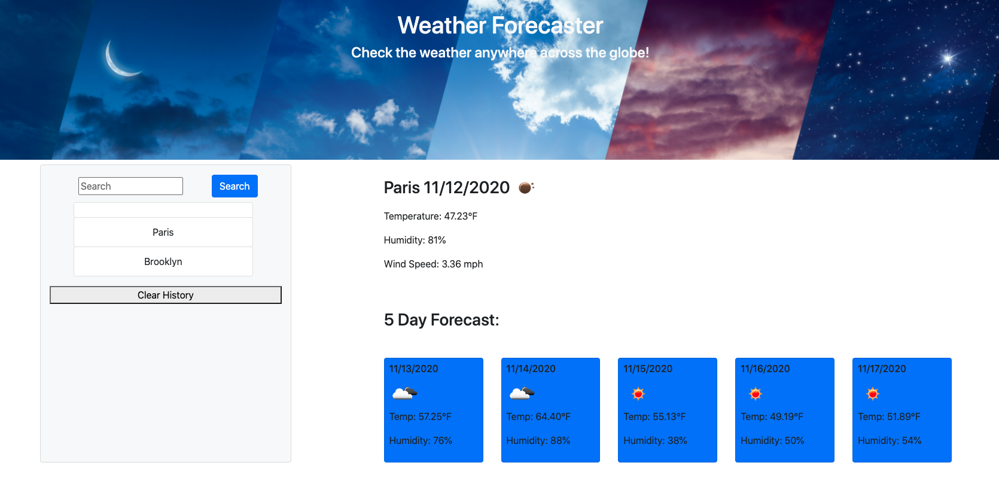

## weather-forecaster

  ##Project Name
   Weather Forcaster
    

## Table of Contents 

- [Description](#description) 
- [Usage](#usage) 
- [License](#license) 
- [Contributing](#contributing) 

- [Questions](#questions) 

## Description
    A weather forecast app that allows the user to search for weather conditions currently in any city. It also shows the next 5 day forecast.
 ## Usage
    For anyone who wants to check the weather.
  ## License
  This application is covered by the MIT license;

  
  
  ## Contributors
  Me, Myself, and I.
 

   

 ## Questions  
 GitHub: [Northjw](https://github.com/Northjw)  
 
 For any questions about this project please contact: northjw1@gmail.com   
